# Documentación TFG DAW — Plataforma de Clubs de Lectura

---

## ÍNDICE

1. [Arquitectura del sistema](#1-arquitectura-del-sistema)
2. [Tipos de usuarios y roles](#2-tipos-de-usuarios-y-roles)
3. [Modelo de base de datos](#3-modelo-de-base-de-datos)
4. [Mapa de navegación](#4-mapa-de-navegación)
5. [Implementación técnica](#5-implementación-técnica)
6. [Instalación y despliegue](#6-instalación-y-despliegue)
7. [Conclusiones](#7-conclusiones)
8. [Descripción funcional completa de la aplicación](#8-descripción-funcional-completa-de-la-aplicación)

---

## 1. Arquitectura del sistema

La aplicación sigue el patrón **MVC (Modelo-Vista-Controlador)** distribuido en dos capas diferenciadas:

- **Modelo**: entidades Doctrine ORM mapeadas a MariaDB 10.11. Incluye 16 entidades (User, Book, Shelf, ShelfBook, ReadingProgress, Club, ClubMember, ClubJoinRequest, ClubChat, ClubChatMessage, BookReview, Post, PostLike, PostComment, Follow, Notification) y sus repositorios.
- **Vista**: aplicación SPA en React 18 + TypeScript 5, compilada con Vite 5.
- **Controlador**: 12 controladores PHP en Symfony 7.4 bajo `backend/src/Controller/Api/`, que exponen endpoints REST bajo el prefijo `/api`.

La infraestructura completa se levanta con **Docker Compose**, con cuatro servicios:

| Servicio    | Imagen / Tecnología        | Función                                                  |
|-------------|----------------------------|----------------------------------------------------------|
| `db`        | mariadb:10.11              | Base de datos relacional                                 |
| `php`       | PHP 8.2-FPM (Alpine)       | Ejecución del backend Symfony vía FastCGI (puerto 9000)  |
| `frontend`  | nginx:alpine + build Vite  | Sirve los archivos estáticos compilados de React         |
| `nginx`     | nginx:alpine               | Reverse proxy: enruta `/api` → PHP, `/uploads` → disco, `/` → frontend |

**Flujo de una petición:**

```
Navegador → Nginx :80
  ├─ /api/*       → FastCGI → php:9000 (Symfony)
  │                    └─ Doctrine ORM → MariaDB
  ├─ /uploads/*   → archivos estáticos en disco (avatars, posts)
  └─ /*           → proxy → frontend:80 (React SPA)
```

La autenticación es **basada en sesión**: Symfony genera una cookie `PHPSESSID` en el login y todas las peticiones del frontend incluyen `credentials: 'include'` para enviarla automáticamente.

---

## 2. Tipos de usuarios y roles

La plataforma distingue tres niveles de acceso:

### Usuario anónimo (no autenticado)
Puede navegar por la página de inicio, buscar libros y explorar la lista de clubs. No puede interactuar con ninguno (no puede crear clubs, añadir libros a estanterías, ni ver el feed social).

### Usuario registrado
Accede a la funcionalidad completa de la plataforma:
- Crear y gestionar estanterías personales de libros.
- Hacer seguimiento del progreso de lectura.
- Escribir reseñas con valoración de 1 a 5 estrellas.
- Crear clubs de lectura o unirse a clubs existentes.
- Participar en los chats de los clubs.
- Seguir a otros usuarios y ver su actividad en el feed.
- Publicar posts con imágenes.
- Configurar la privacidad del perfil.

### Administrador
Hereda todos los permisos del usuario registrado y además accede al panel `/admin`:
- Ver estadísticas globales de la plataforma (usuarios, clubs, publicaciones).
- Gestionar cuentas de usuario: dar o quitar rol de administrador, eliminar cuentas.
- Eliminar clubs y publicaciones.
- Establecer el libro del mes en cualquier club.

La diferenciación de roles se gestiona mediante el campo booleano `isAdmin` en la entidad `User`. En el backend, los endpoints de administración comprueban `$this->getUser()->isAdmin()` antes de ejecutar la operación. En el frontend, el componente `AdminPage` verifica `user?.roles?.includes('ROLE_ADMIN')` al montarse y redirige a `/` si no se cumple.

---

## 3. Modelo de base de datos

La base de datos MariaDB 10.11 contiene **16 tablas** gestionadas con Doctrine ORM. A continuación se describe cada entidad y sus relaciones principales.

### Entidades y campos clave

**User** — Cuenta de usuario  
`id`, `email` (único), `password` (bcrypt), `displayName`, `bio`, `avatar`, `isAdmin`, `isPrivate`, `shelvesPublic`, `clubsPublic`, `createdAt`
!(admin)[images/admin1.png]
!(admin)[images/admin2.png]
!(admin)[images/admin3.png]

**Book** — Libro importado desde Google Books  
`id`, `externalId` (Google Books ID, único), `title`, `authors` (JSON), `description`, `coverUrl`, `thumbnail`, `publisher`, `publishedDate`, `pageCount`, `isbn`, `language`, `googleBooksUrl`
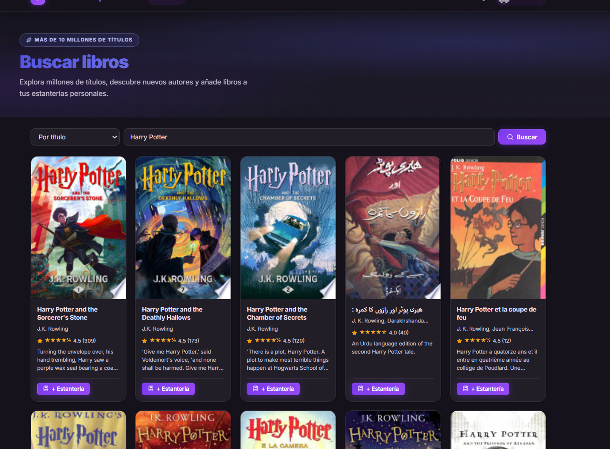

**BookReview** — Reseña de un libro  
`id`, `rating` (1-5), `status` (want_to_read/reading/read), `body`, `createdAt`  
Relaciones: `ManyToOne(User)`, `ManyToOne(Book)`
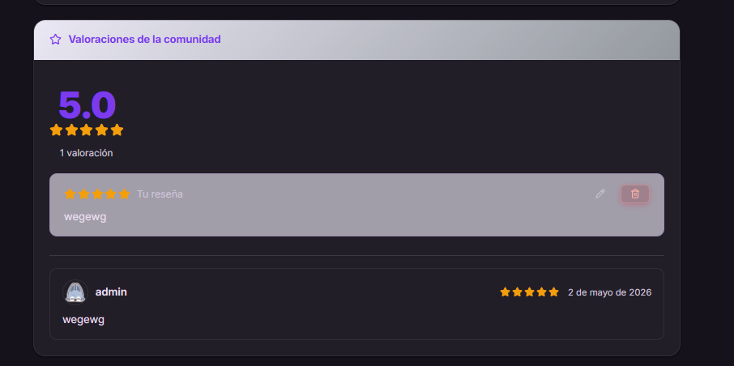

**Shelf** — Estantería personal  
`id`, `name`, `createdAt`  
Relaciones: `ManyToOne(User)`, `OneToMany(ShelfBook)`

**ShelfBook** — Libro en una estantería  
`id`, `readStatus` (want_to_read/reading/read), `addedAt`  
Relaciones: `ManyToOne(Shelf)`, `ManyToOne(Book)`

**ReadingProgress** — Seguimiento de lectura activo  
`id`, `mode` (pages/percent), `currentPage`, `totalPages`, `percent`, `startedAt`, `updatedAt`  
Relaciones: `ManyToOne(User)`, `ManyToOne(Book)`

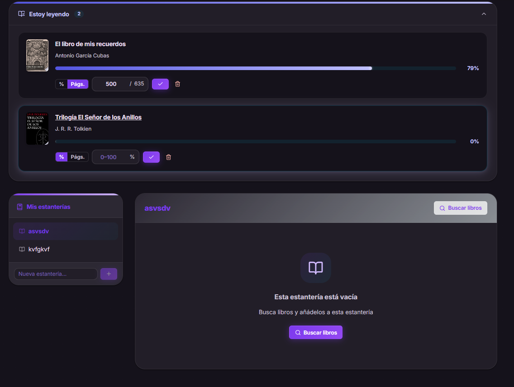

**Club** — Club de lectura  
`id`, `name`, `description`, `visibility` (public/private), `createdAt`  
Relaciones: `ManyToOne(User)` (creador), `OneToMany(ClubMember)`, `ManyToOne(Book)` (currentBook), `currentBookDateFrom`, `currentBookDateUntil`

**ClubMember** — Membresía de un usuario en un club  
`id`, `role` (admin/member), `joinedAt`  
Relaciones: `ManyToOne(Club)`, `ManyToOne(User)`

**ClubJoinRequest** — Solicitud de adhesión a club privado  
`id`, `status` (pending/accepted/rejected), `requestedAt`  
Relaciones: `ManyToOne(Club)`, `ManyToOne(User)`

**ClubChat** — Hilo de chat dentro de un club  
`id`, `name`, `description`, `createdAt`  
Relaciones: `ManyToOne(Club)`, `OneToMany(ClubChatMessage)`

**ClubChatMessage** — Mensaje en un chat de club  
`id`, `body`, `createdAt`  
Relaciones: `ManyToOne(ClubChat)`, `ManyToOne(User)`

**Post** — Publicación con imagen  
`id`, `imageUrl`, `description`, `createdAt`  
Relaciones: `ManyToOne(User)`, `OneToMany(PostLike)`, `OneToMany(PostComment)`

**PostLike** — Like a una publicación  
`id`, `createdAt`  
Relaciones: `ManyToOne(Post)`, `ManyToOne(User)`

**PostComment** — Comentario en una publicación  
`id`, `body`, `createdAt`  
Relaciones: `ManyToOne(Post)`, `ManyToOne(User)`

**Follow** — Relación de seguimiento entre usuarios  
`id`, `status` (pending/accepted), `createdAt`  
Relaciones: `ManyToOne(User)` (follower), `ManyToOne(User)` (following)

**Notification** — Notificación del sistema  
`id`, `type`, `payload` (JSON), `isRead`, `createdAt`  
Relaciones: `ManyToOne(User)` (destinatario)

### Diagrama de relaciones principales

```
User ──< Shelf ──< ShelfBook >── Book
User ──< ReadingProgress >── Book
User ──< BookReview >── Book
User ──< ClubMember >── Club
User ──< Follow >── User
User ──< Post ──< PostLike >── User
Club ──< ClubChat ──< ClubChatMessage >── User
Club >── Book (currentBook)
Club ──< ClubJoinRequest >── User
User ──< Notification
```
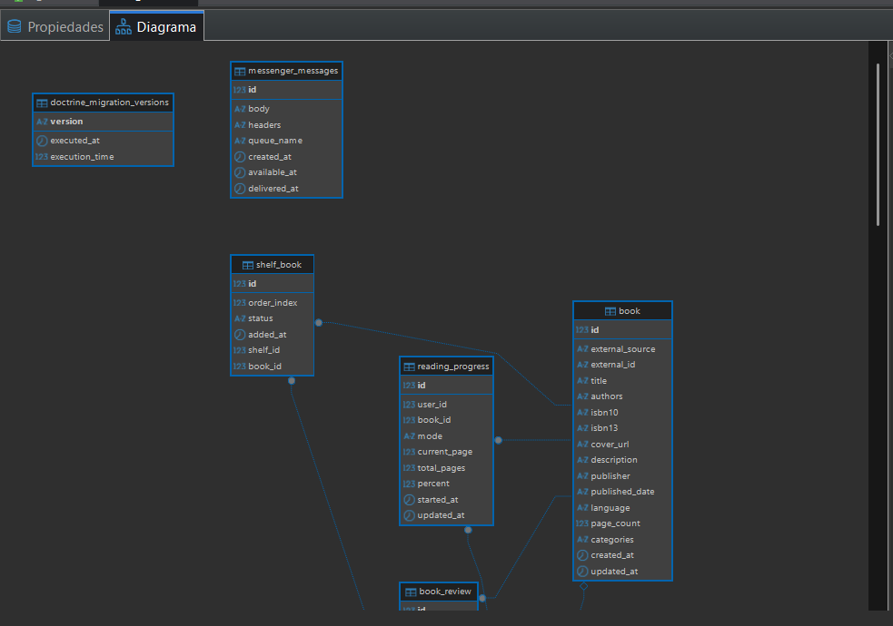
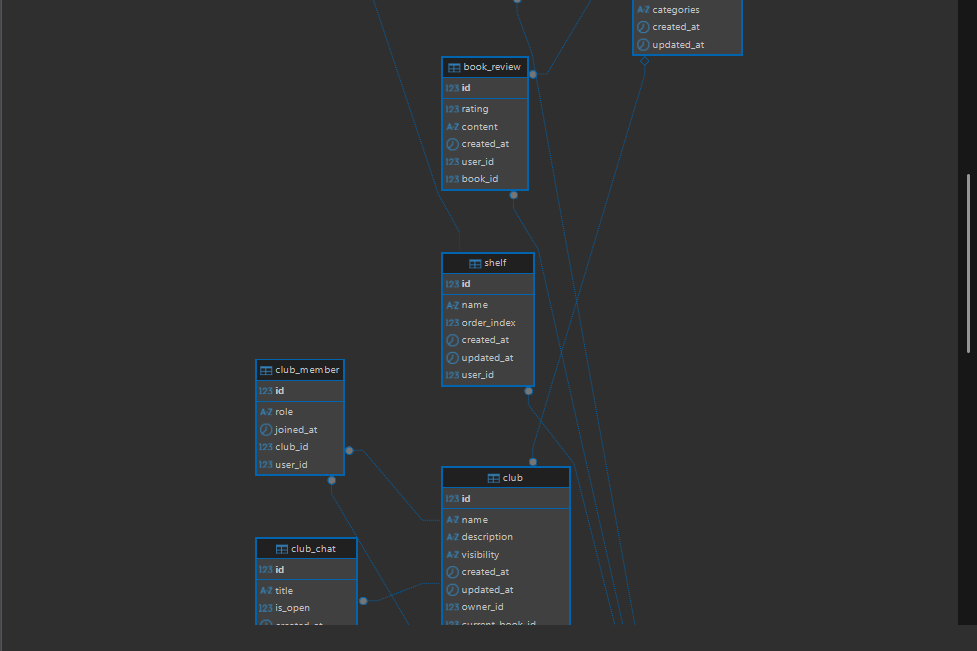
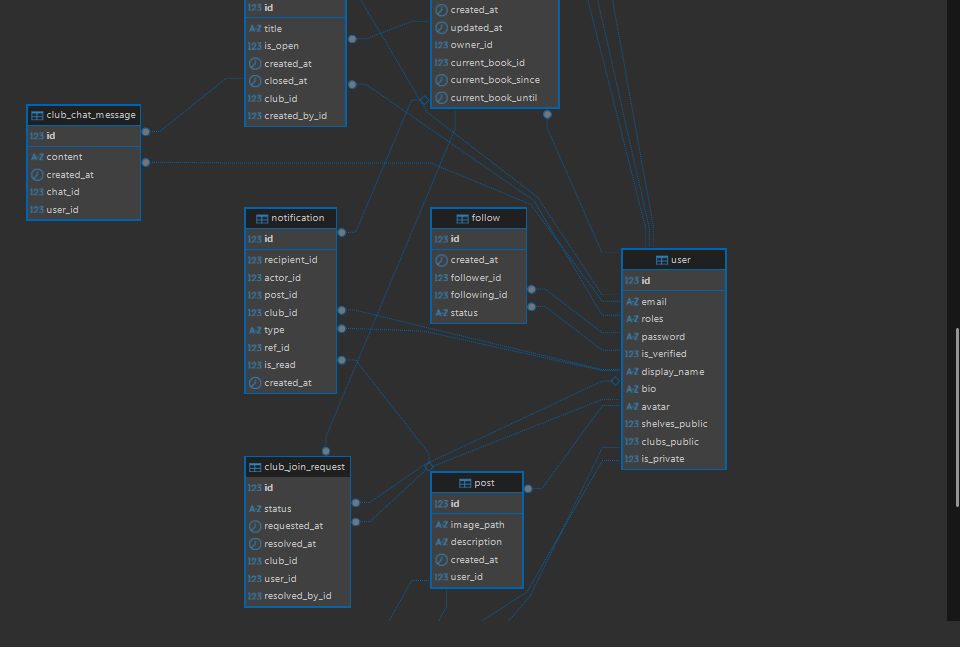
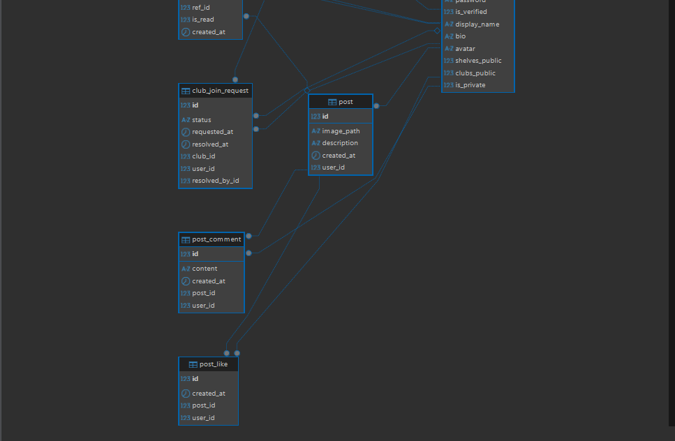
---

## 4. Mapa de navegación

### Rutas públicas (accesibles sin autenticación)

| Ruta               | Página                  | Descripción                              |
|--------------------|-------------------------|------------------------------------------|
| `/`                | HomePage                | Inicio, hero y feed (autenticados)       |
| `/login`           | LoginPage               | Inicio de sesión                         |
| `/register`        | RegisterPage            | Crear cuenta nueva                       |
| `/books`           | BooksPage               | Búsqueda de libros                       |
| `/books/:id`       | BookDetailPage          | Detalle de libro y reseñas               |
| `/clubs`           | ClubsPage               | Lista de clubs de lectura                |
| `/clubs/:id`       | ClubDetailPage          | Detalle y chats de un club               |
| `/users`           | UsersPage               | Búsqueda de lectores                     |
| `/users/:id`       | PublicProfilePage       | Perfil público de un usuario             |
| `/admin`           | AdminPage               | Panel admin (redirige si no es admin)    |

### Rutas protegidas (requieren autenticación)

| Ruta        | Página       | Guard                        |
|-------------|--------------|------------------------------|
| `/shelves`  | ShelvesPage  | `<PrivateRoute>` → `/login`  |
| `/profile`  | ProfilePage  | `<PrivateRoute>` → `/login`  |

Si un usuario no autenticado intenta acceder a una ruta protegida, `PrivateRoute` lo redirige a `/login` guardando la URL de origen en `location.state.from`. Tras el login exitoso, es redirigido de vuelta a la URL original.

---

## 5. Implementación técnica

### 5.1 Backend — Symfony 7.4

**Autenticación y seguridad**  
Symfony Security gestiona el ciclo de sesión. En `security.yaml` se configura `json_login` sobre el endpoint `/api/login`, con manejadores personalizados de éxito y fallo que devuelven JSON en lugar de redirecciones. El hash de contraseñas usa `algorithm: auto` (bcrypt con coste configurable). Las sesiones son stateful (`stateless: false`) y se almacenan en el servidor.

**Estructura de controladores**  
Cada módulo de la API es un controlador independiente bajo `src/Controller/Api/`:

| Controlador               | Prefijo           | Función principal                           |
|---------------------------|-------------------|---------------------------------------------|
| AuthApiController         | `/api`            | Login, logout, registro, sesión actual      |
| UserApiController         | `/api/users`      | Búsqueda, seguimiento, perfil público       |
| BookExternalApiController | `/api/books`      | Búsqueda e importación desde Google Books   |
| BookReviewApiController   | `/api/books`      | CRUD de reseñas y estadísticas              |
| ShelfApiController        | `/api/shelves`    | CRUD de estanterías y libros en ellas       |
| ReadingProgressApiController | `/api/reading-progress` | Seguimiento de lectura            |
| ClubApiController         | `/api/clubs`      | CRUD de clubs, miembros, solicitudes        |
| ClubChatApiController     | `/api/clubs`      | Chats y mensajes de club                    |
| PostApiController         | `/api/posts`      | Posts, likes, feed social                   |
| FollowApiController       | `/api/users`      | Seguir, dejar de seguir, listas             |
| NotificationApiController | `/api/notifications` | Listar y marcar notificaciones           |
| AdminApiController        | `/api/admin`      | Estadísticas y gestión de plataforma        |

**Subida de archivos**  
Los avatars y las imágenes de posts se reciben como `multipart/form-data`, se validan (tipo MIME, tamaño máximo 20 MB configurado en Nginx), se renombran con `uniqid()` y se guardan en `/var/uploads/`. La URL resultante se almacena en la entidad.

### 5.2 Frontend — React 18 + TypeScript

**Cliente HTTP centralizado**  
`api/client.ts` exporta `apiFetch<T>(endpoint, method, body)` y `apiFormData<T>(endpoint, formData)`. Ambas funciones:
- Añaden automáticamente `credentials: 'include'` para enviar la cookie de sesión.
- Prefijan la URL con `/api`.
- Si la respuesta HTTP no es ok (4xx/5xx), extraen el campo `error` del JSON y lanzan `new Error(data.error)`.

**Gestión de estado de autenticación**  
`AuthContext` provee `user`, `login`, `logout` y `refresh` a toda la aplicación. Al montar la app, llama a `GET /api/auth/me` para restaurar la sesión si existe. `login()` llama a `POST /api/login` y actualiza el estado global. `logout()` llama a `POST /api/auth/logout` y limpia el estado.

**Enrutamiento**  
`App.tsx` define 12 rutas con `react-router-dom`. Las rutas `/shelves` y `/profile` están envueltas en `<PrivateRoute>`, que verifica el estado de `AuthContext` y redirige a `/login` si `user` es `null`.

**Sistema de notificaciones toast**  
`ToastProvider` en `Toast.tsx` gestiona una cola de notificaciones. `useToast()` expone la función `toast(mensaje, tipo)`. Cada notificación se autodismiss tras 3 500 ms. Está marcado con `aria-live="polite"` para accesibilidad.

**Diseño visual y tokens CSS**  
`tokens.css` define todas las variables del sistema de diseño: paleta de colores (morado `#7c3aed`, cian `#0891b2`, rosa `#e11d48`), gradientes, sombras, radios, tipografía, transiciones y keyframes de animación. Los 9 archivos CSS de `styles/` importan estas variables para mantener coherencia visual.

**Accesibilidad (WAI-A)**  
- `aria-label` en botones de icono sin texto visible.
- `aria-expanded` en el menú hamburguesa de la Navbar.
- `aria-live="polite"` en el sistema de toasts.
- `role="dialog"` y `aria-modal="true"` en los modales.
- `role="button"` y `tabIndex={0}` con manejador `onKeyDown` en elementos div interactivos.
- Atributos `autoComplete` correctos en todos los campos de formulario.

### 5.3 Comunicación API — referencia de módulos

Cada módulo de la API del frontend (`api/books.ts`, `api/shelves.ts`, `api/clubs.ts`, etc.) exporta un objeto con métodos tipados que encapsulan las llamadas a `apiFetch`. Los tipos TypeScript de request y response están definidos en el mismo archivo, garantizando coherencia entre lo que envía el frontend y lo que espera el backend.

---

## 6. Instalación y despliegue

### Requisitos previos
- Docker Desktop (Windows/macOS) o Docker Engine + Docker Compose (Linux).
- Git para clonar el repositorio.

### Pasos de instalación

**1. Clonar el repositorio**
```bash
git clone <url-del-repositorio>
cd TFGdaw
```

**2. Crear el archivo de variables de entorno del backend**  
Crear `backend/.env.local` con:
```
DATABASE_URL="mysql://app:secret@db:3306/tfgdaw?serverVersion=10.11.0-MariaDB"
APP_SECRET=<clave-aleatoria-larga>
APP_ENV=prod
```

**3. Levantar los contenedores**
```bash
docker compose up -d --build
```
Este comando construye las imágenes (PHP con extensiones, compilación Vite del frontend), crea los volúmenes `db_data` y `uploads`, y arranca los cuatro servicios.

**4. Ejecutar las migraciones de base de datos**
```bash
docker compose exec php bin/console doctrine:migrations:migrate --no-interaction
```

**5. Acceder a la aplicación**  
Abrir `http://localhost` en el navegador. Nginx escucha en el puerto 80.

### Configuración de Nginx

```nginx
# /api/* → PHP-FPM (Symfony)
location /api {
    fastcgi_pass php:9000;
    include fastcgi_params;
    fastcgi_param SCRIPT_FILENAME /var/www/html/public/index.php;
}

# /uploads/* → archivos estáticos con caché de 7 días
location /uploads {
    root /var/uploads;
    expires 7d;
    add_header Cache-Control "public, immutable";
}

# /* → contenedor frontend (React SPA)
location / {
    proxy_pass http://frontend:80;
}
```

`client_max_body_size 20M` permite subir imágenes de hasta 20 MB.

### Optimizaciones de producción del backend

El `Dockerfile` del backend configura con `opcache.validate_timestamps=0` para no revalidar archivos en cada petición, y ejecuta `cache:warmup` durante la construcción para pre-compilar contenedores Symfony. El servidor PHP-FPM expone el puerto 9000 exclusivamente en la red interna Docker.

---

## 7. Conclusiones

### Objetivos alcanzados

El proyecto ha cumplido los objetivos funcionales planteados inicialmente:

- **Biblioteca personal**: sistema completo de estanterías con tres estados de lectura, seguimiento de progreso por páginas o porcentaje, y visualización con barra de progreso.
- **Búsqueda de libros**: integración con Google Books API con tres modos de búsqueda, paginación y caché local en base de datos.
- **Reseñas y valoraciones**: sistema de reseñas con puntuación 1-5 estrellas, distribución visual de valoraciones y gestión de la propia reseña.
- **Clubs de lectura**: clubs públicos y privados, chats organizados por hilos, libro del mes con período de lectura, gestión de miembros y solicitudes.
- **Red social**: seguimiento de usuarios, feed personalizado, publicaciones con imágenes, likes y sistema de notificaciones.
- **Panel de administración**: gestión completa de usuarios, clubs y publicaciones con estadísticas globales.

### Valoración técnica

La separación entre frontend SPA y backend API REST ha demostrado ser la arquitectura adecuada para este tipo de aplicación interactiva. Symfony 7.4 con Doctrine ORM proporciona un backend robusto con migraciones gestionadas y un ORM que abstrae las consultas SQL. React 18 con TypeScript aporta seguridad de tipos en tiempo de desarrollo y una experiencia de usuario fluida gracias a las actualizaciones de estado local sin recargas de página.

El uso de Docker Compose garantiza que el entorno de desarrollo y producción sean idénticos, eliminando problemas de configuración y facilitando el despliegue en cualquier servidor con Docker instalado.

### Limitaciones y trabajo futuro

- **Tiempo real**: los chats actualmente requieren recargar la página para ver mensajes nuevos. Una mejora sería implementar WebSockets (Mercure Hub de Symfony o Socket.io) para actualización en tiempo real.
- **Notificaciones push**: el sistema de notificaciones funciona con polling cada 60 segundos. Las notificaciones push nativas del navegador (Web Push API) ofrecerían una experiencia más inmediata.
- **Búsqueda avanzada de libros**: actualmente se delega en Google Books. Una indexación local con Elasticsearch permitiría búsquedas más ricas y sin dependencia de un servicio externo.
- **Audio/vídeo**: la naturaleza de la aplicación (biblioteca de lectura y red social de lectores) no requiere ni se beneficia de la incorporación de contenido multimedia de audio o vídeo.

---

## 8. Descripción funcional completa de la aplicación

### 8.1 Sistema de gestión de errores y estados globales

La aplicación implementa tres niveles de gestión de errores aplicados de forma consistente en todas las páginas:

**Nivel 1 — Estado de carga (loading state)**  
Cada operación asíncrona actualiza un booleano `loading` o `saving` mediante `useState`. Mientras la petición está en curso, el botón implicado se deshabilita (`disabled={loading}`) y muestra el componente `<Spinner>` en sustitución del texto habitual. El spinner es un `<span>` con `aria-label="Cargando"` y animación CSS `spin` de 360 grados, garantizando retroalimentación visual sin bloquear el resto de la interfaz.

**Nivel 2 — Mensajes de error en línea (inline error)**  
Para errores que impiden que una página cargue correctamente, el mensaje se almacena en un estado `error` y se renderiza con `<div className="alert alert-danger">`. Este bloque aplica fondo rojo pálido (`--color-danger-bg`), borde rojo (`--color-danger-border`) y texto en `--color-danger`.

**Nivel 3 — Notificaciones toast**  
Para operaciones que el usuario desencadena activamente (crear, borrar, mover), se usa el sistema de toasts de `Toast.tsx`. La función `toast(mensaje, tipo)` acepta `'success'`, `'error'` e `'info'`. El toast aparece en la esquina inferior derecha, se autodismiss a los 3 500 ms y está marcado con `aria-live="polite"`.

**Envoltorio de peticiones — `apiFetch`**  
Todas las llamadas HTTP pasan por `apiFetch<T>(endpoint, method, body)` en `api/client.ts`. Añade automáticamente `credentials: 'include'` para enviar la cookie de sesión. Si el servidor responde con un código HTTP no-ok, extrae el campo `error` del JSON y lanza `new Error(data.error)`, que los bloques `catch` de cada página capturan y muestran al usuario.

**Códigos de error del servidor y su tratamiento en el frontend:**

| Código | Significado         | Comportamiento en el frontend                             |
|--------|---------------------|-----------------------------------------------------------|
| 400    | Datos inválidos     | Mensaje del servidor en alerta roja inline                |
| 401    | No autenticado      | La sesión ya no es válida; redirigir al login             |
| 403    | Sin permisos        | Mensaje de error inline o redirección a inicio            |
| 404    | Recurso no existe   | Mensaje "no encontrado" con enlace de vuelta              |
| 409    | Conflicto/duplicado | Mensaje del servidor (ej.: "ya eres miembro")             |
| 502    | Error infraestructura | Error de red genérico; mensaje al usuario               |

---

### 8.2 Página de inicio — `HomePage` (`/`)

**Propósito:** Punto de entrada de la aplicación. Presenta la propuesta de valor y, si el usuario está autenticado, muestra el feed social personalizado.

**Elementos de la interfaz:**
- Sección **hero** con eyebrow "Plataforma de lectura", título animado, descripción y estadísticas (10M+ libros, 3 modos de búsqueda, ∞ clubs).
- **Llamadas a la acción**: sin sesión → botones a `/register` y `/clubs`; con sesión → botones a `/clubs` y `/shelves`.
- **Feed social** (solo autenticados): rejilla de publicaciones `PostCard` de las personas que sigue el usuario.
- **Sección de funcionalidades**: tres tarjetas que resumen búsqueda de libros, estanterías y clubs.

**Flujo de carga del feed:**
1. `useEffect` se activa cuando `user` está disponible en el contexto.
2. Llama a `GET /api/posts/feed`.
3. Durante la carga se muestra `<Spinner size={32} />` centrado.
4. Si la respuesta está vacía, estado vacío con enlace a `/users`.
5. Si hay posts, se renderizan como componentes `<PostCard>`.

**Estados de error:**
- Si `postsApi.feed()` falla, el error se ignora silenciosamente (`catch(() => {})`). El feed simplemente no aparece para no romper la página principal ante un error secundario.
- Si la sesión es inválida (401), `AuthContext` ha detectado previamente que `user` es `null` y el feed no se solicita.
!(homePage)[images/HomePage.png]
---

### 8.3 Página de inicio de sesión — `LoginPage` (`/login`)

**Propósito:** Autenticar al usuario con correo y contraseña.

**Flujo:**
1. El usuario introduce email (`type="email"`, validación nativa del navegador) y contraseña.
2. Al enviar, se llama a `login(email, password)` del `AuthContext`.
3. `login` llama a `POST /api/login` con las credenciales en JSON.
4. Si el servidor confirma la sesión, se redirige a `location.state.from` (URL de origen si el usuario fue redirigido desde una ruta protegida) o a `/`.

**Estados de error:**
- Mientras se procesa: botón muestra `<Spinner>` y está deshabilitado.
- Credenciales incorrectas (HTTP 401): alerta roja con el mensaje del servidor o "Credenciales incorrectas" por defecto.
- Error de red: el mismo bloque de alerta muestra el mensaje de excepción.
- Los campos tienen `autocomplete="email"` y `autocomplete="current-password"` para autocompletado del navegador.
!(homePage)[images/LoginPage.png]
---

### 8.4 Página de registro — `RegisterPage` (`/register`)

**Propósito:** Crear una nueva cuenta de usuario.

**Flujo:**
1. El usuario rellena nombre visible, email, contraseña y confirmación.
2. **Validación en cliente** antes de enviar: contraseña ≥ 6 caracteres, ambas contraseñas coinciden. Si falla, se muestra el error y no se realiza ninguna petición.
3. Si la validación pasa, llama a `POST /api/register`.
4. Tras el registro exitoso, llama automáticamente a `login(email, password)` y redirige a `/`.

**Estados de error:**
- Contraseña demasiado corta: "La contraseña debe tener al menos 6 caracteres".
- Contraseñas no coincidentes: "Las contraseñas no coinciden".
- Email ya registrado (HTTP 409): mensaje del servidor en alerta roja.
- Error de red: "Error al crear la cuenta".
- Durante el proceso: botón muestra `<Spinner>` y está deshabilitado (evita envíos duplicados).
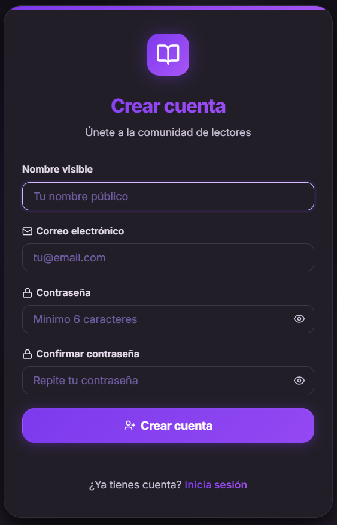
---

### 8.5 Página de búsqueda de libros — `BooksPage` (`/books`)

**Propósito:** Buscar libros en la base de Google Books e importarlos a estanterías personales.

**Elementos de la interfaz:**
- Barra de búsqueda con selector de modo (texto libre / por título / por autor).
- Chips de sugerencias predefinidas visibles antes de la primera búsqueda.
- Rejilla de tarjetas con portada, título, autores, valoración media de Google Books y número de reseñas.
- Paginador con botones "Anterior" / "Siguiente" y contador.
- **ShelfDrawer**: panel deslizante que permite añadir el libro a estanterías o marcarlo como "Estoy leyendo".

**Flujo de búsqueda:**
1. El usuario escribe y pulsa "Buscar" o selecciona una sugerencia.
2. Llama a `GET /api/books/search?q=...&page=1&limit=12`.
3. El backend consulta Google Books API e importa libros nuevos a la base de datos local.
4. Los resultados se muestran con portada o con el placeholder `<BookOpen>` si no hay imagen.

**ShelfDrawer — flujo:**
1. Pulsar "+ Estantería" abre el drawer con overlay oscuro.
2. Botón "Estoy leyendo" → `POST /api/reading-progress`.
3. Cada estantería tiene un botón; al pulsarlo → `POST /api/shelves/{id}/books`.
4. Una vez añadido, el botón cambia a estado "done" con `<CheckCircle>` verde y queda deshabilitado.
5. Se puede crear una nueva estantería desde el drawer sin cerrarlo.

**Estados de error:**
- Sin resultados: estado vacío "No se encontraron resultados. Prueba con otros términos".
- Fallo en la búsqueda: alerta roja con el mensaje de error.
- Fallo al añadir a estantería: mensaje de error inline compacto dentro del ShelfDrawer.
- Usuario no autenticado: el botón "+ Estantería" no se renderiza.

---

### 8.6 Página de detalle de libro — `BookDetailPage` (`/books/:externalId`)

**Propósito:** Ver información completa de un libro, gestionar progreso de lectura y leer/escribir reseñas.

**Elementos de la interfaz:**
- Cabecera con portada grande, título, autores, editorial, año, ISBN, páginas, enlace a Google Books y descripción completa.
- **Valoración global** estilo Amazon: puntuación media, distribución de estrellas 1-5 con barras proporcionales y total de valoraciones.
- Botón "Añadir a estantería" (usuarios autenticados) que abre el ShelfDrawer.
- Botón "Estoy leyendo".
- Panel de **escritura de reseña**: selector interactivo de estrellas con hover, selector de estado de lectura.
- Lista de **reseñas de la comunidad** con avatar DiceBear, nombre, fecha y texto. El usuario puede editar o eliminar la suya.

**Flujo de carga:**
1. `useParams` extrae el `externalId` de la URL.
2. Tres peticiones: `GET /api/books/{id}`, `GET /api/books/{id}/reviews/stats`, `GET /api/books/{id}/reviews`.
3. Si el libro no está en base de datos local, el backend lo importa desde Google Books.

**Flujo de reseña:**
1. El usuario selecciona estrellas, estado de lectura y escribe el texto.
2. Llama a `POST /api/books/{externalId}/reviews`.
3. La reseña aparece en la lista sin recargar; las estadísticas se actualizan.
4. Editar: los campos se precargan con los valores actuales → `PATCH /api/books/{externalId}/reviews/{id}`.
5. Borrar: confirmación inline → `DELETE /api/books/{externalId}/reviews/{id}`.

**Estados de error:**
- Libro no encontrado (404): "No se pudo cargar el libro" con enlace "Volver a libros".
- Error al publicar reseña: mensaje inline rojo bajo el formulario.
- Error al borrar: fallo silencioso, el ítem no desaparece.
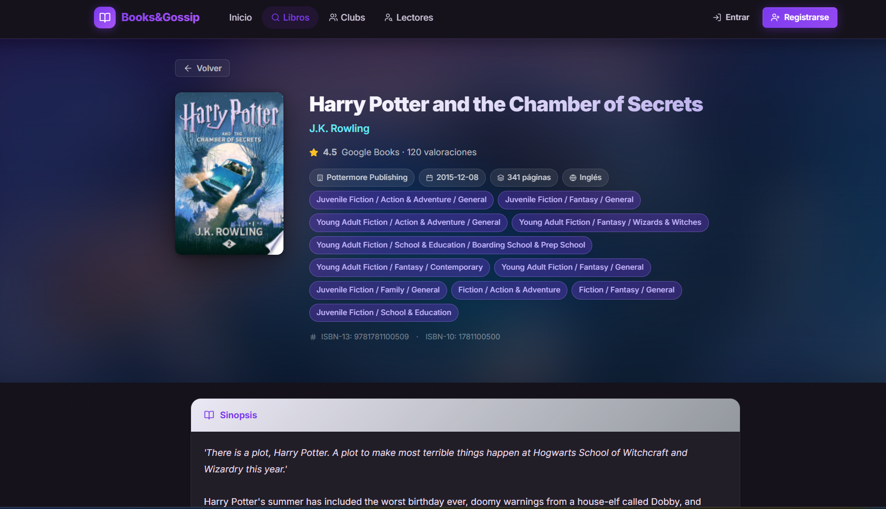
---

### 8.7 Página de estanterías — `ShelvesPage` (`/shelves`) *(ruta protegida)*

**Propósito:** Gestionar estanterías personales y hacer seguimiento del progreso lector.

**Estructura visual:**
- Banner "Mis estanterías".
- **ReadingTracker**: panel colapsable encima de las estanterías. Solo visible si hay libros en seguimiento activo.
- **Layout dos columnas**: sidebar con lista de estanterías + formulario de creación; panel derecho con libros de la estantería activa.

**ReadingTracker — funcionalidad:**
- Cada `ReadingCard` muestra portada, título, barra de progreso y controles.
- Dos modos: porcentaje (0-100%) o páginas (actual / total). El total proviene del campo `pageCount` del libro o lo introduce el usuario.
- Guardar progreso → `PATCH /api/reading-progress/{id}`.
- Eliminar seguimiento: confirmación inline "¿Quitar?" antes de llamar a `DELETE /api/reading-progress/{id}`. Toast: `"[título]" quitado del seguimiento`.

**Estanterías — funcionalidad:**
- **Crear**: formulario en sidebar → `POST /api/shelves`. Toast: `Estantería "[nombre]" creada`.
- **Eliminar**: botón de papelera con confirmación inline → `DELETE /api/shelves/{id}`. Toast: `Estantería "[nombre]" eliminada`. Si era la activa, selecciona la siguiente disponible.
- **Seleccionar**: clic en nombre → carga libros con `GET /api/shelves/{id}/books`.
- **Quitar libro**: botón rojo con confirmación inline → `DELETE /api/shelves/{id}/books/{bookId}`. Toast: `"[título]" quitado de la estantería`.

**Estados de error:**
- Fallo al cargar estanterías: alerta roja en el sidebar.
- Fallo al crear estantería: toast de error.
- Fallo al eliminar estantería o libro: toast de error.
- Fallo al guardar progreso: silencioso, el estado visual no cambia.
- Estantería vacía: estado vacío con botón "Buscar libros".
- Sin estanterías: instrucción de crear la primera desde el formulario lateral.

---

### 8.8 Página de clubs de lectura — `ClubsPage` (`/clubs`)

**Propósito:** Explorar clubs, crear nuevos y gestionar la adhesión.

**Elementos de la interfaz:**
- Banner con botón "Nuevo club" (solo autenticados).
- Barra de búsqueda para filtrar clubs por nombre en tiempo real (filtrado local, sin petición).
- Rejilla de tarjetas `ClubCard`.

**Información de cada ClubCard:**
- Nombre, badge de visibilidad (Público / Privado), badge de rol (Admin / Miembro si aplica).
- Descripción, número de miembros, libro del mes con portada miniatura.
- Botón "Ver club" + botón de acción según estado:
  - Sin rol, club público → "Unirse"
  - Sin rol, club privado → "Solicitar unirse"
  - Solicitud pendiente → "Solicitud enviada" (con icono reloj, no clicable)
  - Miembro → "Abandonar"
  - Admin → sin botón de acción (accede desde "Ver club")

**Crear club:**
1. Pulsar "Nuevo club" expande el panel de creación.
2. Campos: nombre (obligatorio), descripción, visibilidad.
3. Enviar → `POST /api/clubs` → el club aparece al inicio de la lista.

**Unirse / Abandonar:**
- Unirse (público): `POST /api/clubs/{id}/join`.
- Solicitar (privado): misma llamada, crea solicitud pendiente.
- Abandonar: modal `ConfirmDialog` → `DELETE /api/clubs/{id}/leave`.

**Estados de error:**
- Fallo al cargar clubs: alerta roja con mensaje.
- Fallo al crear club: mensaje inline bajo el formulario de creación.
- Fallo al unirse/abandonar: mensaje compacto dentro de la tarjeta.
- Sin resultados de búsqueda: "No hay clubs con ese nombre".
- Sin clubs: "Aún no hay clubs. ¡Sé el primero en crear uno!".
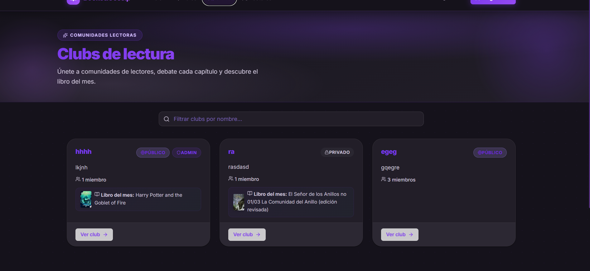
---

### 8.9 Página de detalle de club — `ClubDetailPage` (`/clubs/:id`)

**Propósito:** Centro de actividad del club: chats, miembros, solicitudes y libro del mes.

**Pestañas:**
- **Chats** (predeterminada): lista de hilos de conversación; al seleccionar uno se carga el historial de mensajes.
- **Miembros**: lista con avatar, nombre y fecha de unión. Admins pueden expulsar o promover.
- **Solicitudes** (solo admins, club privado): lista de solicitudes pendientes con Aceptar/Rechazar.

**Cabecera del club:**
- Nombre, visibilidad, descripción, libro del mes (portada + fechas del período).
- Admins ven el botón para cambiar el libro del mes → abre `BookMonthModal`.

**BookMonthModal — flujo:**
1. Admin busca libro por título/autor.
2. Selecciona de los resultados (se resalta con borde de color).
3. Introduce fecha inicio y fin (validación: fin > inicio).
4. Enviar → `PUT /api/clubs/{id}/current-book`.

**Chats — flujo:**
1. Al entrar en Chats se carga la lista → `GET /api/clubs/{id}/chats`.
2. Al seleccionar un chat, se cargan mensajes → `GET /api/clubs/{id}/chats/{chatId}/messages`.
3. Mensaje propio aparece a la derecha; ajenos a la izquierda.
4. Enviar → `POST /api/clubs/{id}/chats/{chatId}/messages` → aparece al final sin recargar.
5. Admins pueden crear nuevos chats → `POST /api/clubs/{id}/chats`.
6. Admins pueden eliminar mensajes con confirmación inline.

**Gestión de miembros (admins):**
- Expulsar: modal `ConfirmDialog` → `DELETE /api/clubs/{id}/members/{userId}`.
- Promover: `PUT /api/clubs/{id}/members/{userId}` con `{ role: 'admin' }`.

**Estados de error:**
- Club no encontrado: "No se pudo cargar el club" + botón "Volver a clubs".
- Fallo al enviar mensaje: error inline en el área de composición.
- Fallo al cargar mensajes: chat vacío.
- Fallo al aceptar/rechazar solicitud: silencioso, la solicitud permanece.
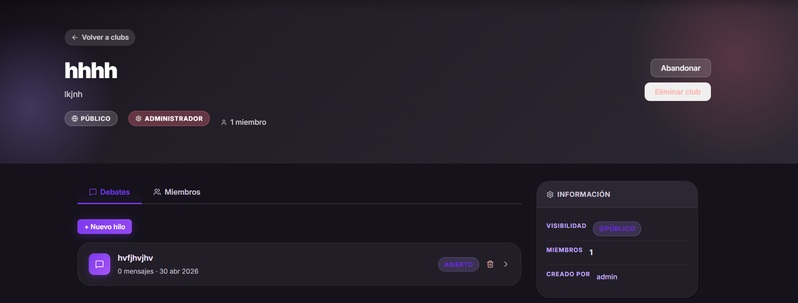
---

### 8.10 Perfil propio — `ProfilePage` (`/profile`) *(ruta protegida)*

**Propósito:** Gestión de la cuenta: información personal, foto, privacidad, contraseña, publicaciones y relaciones sociales.

**Estructura de secciones:**

1. **Sidebar**: avatar, nombre, email, bio, contadores de seguidores y siguiendo (clickables para ver la lista en modal).
2. **Mis publicaciones**: rejilla de posts propios y formulario para crear nuevas publicaciones.
3. **Información personal**: nombre visible y bio → `PATCH /api/profile`. Éxito/error con alertas verde/roja.
4. **Foto de perfil**: subida con previsualización → `POST /api/profile/avatar` como multipart. El avatar sin personalizar se genera con DiceBear Initials.
5. **Privacidad**: tres toggles de guardado automático (sin botón de guardar): perfil privado, estanterías públicas, clubs públicos → `PATCH /api/profile/privacy`.
6. **Cambiar contraseña**: validación cliente (nueva ≥ 6 caracteres, coincidencia) → `POST /api/profile/change-password`.
7. **Sesión**: muestra email actual + botón "Cerrar sesión" → `POST /api/logout` + redirige a `/`.

**Crear publicación:**
1. Pulsar "Nueva publicación" expande el formulario.
2. Click en la zona dropzone → selector de archivo (`accept="image/*"`).
3. La imagen se previsualiza en tiempo real con `FileReader`.
4. El botón "Publicar" está deshabilitado hasta seleccionar imagen.
5. Enviar → `POST /api/posts` como multipart → el post aparece al inicio de la rejilla.

**Modal de seguidores/siguiendo:**
- Abre al pulsar el contador. Muestra lista de usuarios.
- En "Seguidores": botón `X` para eliminar cada seguidor → `DELETE /api/users/{followerId}/followers`.

**Estados de error:**
- Fallo al cargar perfil: spinner perpetuo (fallo silencioso).
- Fallo al guardar información: alerta roja bajo el formulario; éxito: alerta verde que desaparece en 3 s.
- Fallo al subir avatar: alerta roja sobre el formulario de avatar.
- Fallo al cambiar contraseña: alerta roja con mensaje del servidor.
- Fallo al cambiar privacidad: el toggle se revierte automáticamente al valor anterior.
- Fallo al crear publicación: texto en rojo bajo el formulario.
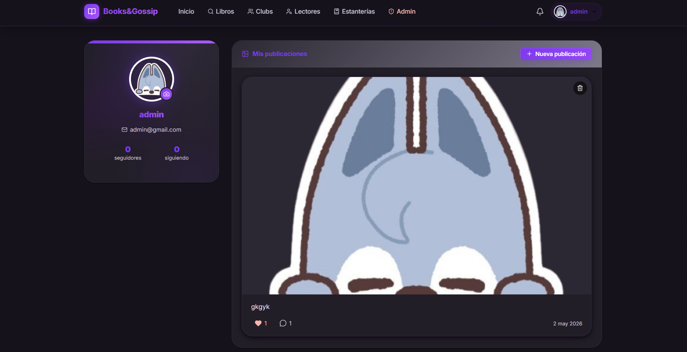
---

### 8.11 Perfil público — `PublicProfilePage` (`/users/:id`)

**Propósito:** Ver la actividad pública de otro usuario y gestionar el seguimiento.

**Contenido mostrado:**
- Avatar, nombre, bio, contadores de seguidores/siguiendo.
- Publicaciones (si perfil no es privado o el usuario las sigue).
- Estanterías (si `shelvesPublic = true`).
- Clubs (si `clubsPublic = true`).

**Seguimiento:**
- Perfil público: "Seguir" → `POST /api/users/{id}/follow` → botón cambia a "Siguiendo".
- Perfil privado: la misma llamada crea solicitud pendiente → botón "Pendiente".
- Dejar de seguir: `DELETE /api/users/{id}/follow`.

**Estados de error:**
- Usuario no encontrado (404): mensaje de error + enlace "Volver".
- Fallo al cargar posts o estanterías: secciones vacías sin mensaje visible.

---

### 8.12 Búsqueda de usuarios — `UsersPage` (`/users`)

**Propósito:** Encontrar otros lectores por nombre y gestionar el seguimiento.

**Flujo de búsqueda:**
- Activación automática con debounce de 350 ms al escribir ≥ 2 caracteres.
- Llama a `GET /api/users/search?q=...`.
- El spinner aparece dentro del propio campo de búsqueda mientras se procesa.

**Tarjeta de resultado (`user-search-card`):**
- Avatar, nombre, bio, contadores de seguidores.
- Botón dinámico según `followStatus`: "Seguir" (primary) / "Siguiendo" (secondary) / "Pendiente" (ghost con icono reloj).
- Si el resultado es el propio usuario: enlace "Mi perfil" → `/profile`.

**Estados de error:**
- Menos de 2 caracteres: estado inicial con instrucción.
- Sin resultados: "Nadie coincide con [término]. Prueba con otro nombre".
- Fallo en la búsqueda: lista vacía sin mensaje explícito.
- Fallo al seguir/dejar de seguir: silencioso, botón vuelve al estado anterior.
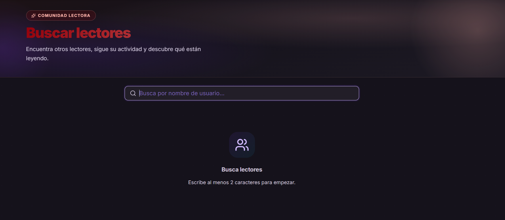
---

### 8.13 Panel de administración — `AdminPage` (`/admin`)

**Propósito:** Gestión de la plataforma por administradores.

**Control de acceso:** El componente verifica `user?.roles?.includes('ROLE_ADMIN')` al montarse. Si no se cumple, redirige inmediatamente a `/` con `useNavigate`. No hay `<PrivateRoute>` en la ruta porque la protección es por rol, no solo por autenticación.

**Tarjetas de estadísticas** (parte superior, fuera de pestañas): tres tarjetas con gradiente mostrando totales de usuarios, clubs y publicaciones → `GET /api/admin/stats`.

**Pestañas (3):**

1. **Usuarios**: tabla completa con búsqueda por nombre/email. Acciones con modal `ConfirmDialog`:
   - Dar/Quitar admin → `PATCH /api/admin/users/{id}/role`.
   - Banear/Desbanear → `PATCH /api/admin/users/{id}/ban`.
   - Eliminar cuenta → `DELETE /api/admin/users/{id}`.

2. **Clubs**: tabla con todos los clubs. Acción: Eliminar (modal `ConfirmDialog`) → `DELETE /api/admin/clubs/{id}`.

3. **Publicaciones**: cuadrícula de todas las publicaciones. Acción: Eliminar (modal `ConfirmDialog`) → `DELETE /api/admin/posts/{id}`.

**Estados de error:**
- Fallo al cargar datos de cualquier panel: arrays vacíos, tablas o cuadrículas vacías.
- Fallo al ejecutar acción admin: silencioso, la interfaz no cambia.
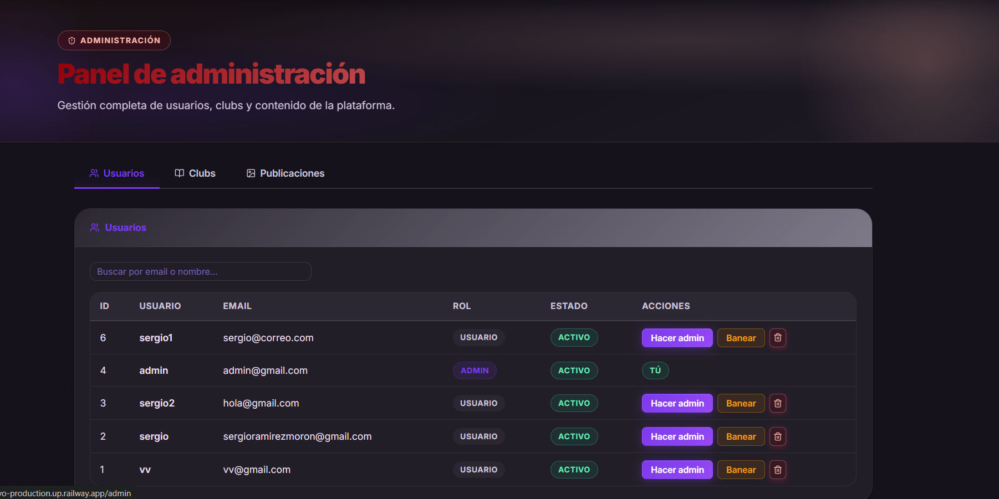
---

### 8.14 Componentes reutilizables

**`Navbar`** — Barra de navegación global, sticky con `backdrop-filter: blur(20px)`. Los enlaces se filtran según el rol. En móvil (<768px): menú hamburguesa con `aria-expanded`, bloqueo de scroll del body y cierre al hacer clic fuera. Icono de notificaciones con polling cada 60 s → badge rojo con contador; clic abre dropdown con la lista.

**`PostCard`** — Tarjeta de publicación con imagen (lazy loading), avatar, nombre, timestamp, contador de likes y botón de like → `POST /api/posts/{id}/like`. El botón de eliminar es visible para el autor del post y para administradores; abre un modal `ConfirmDialog` antes de llamar a `DELETE /api/posts/{id}`.

**`Spinner`** — Carga inline. Acepta prop `size` (px). Renderiza `<span className="spinner" aria-label="Cargando" />` con animación `spin`. Presente en todos los botones de acción asíncrona.

**`Toast`** — Notificaciones no bloqueantes. `ToastProvider` envuelve `App.tsx` y expone `useToast()`. Tipos: `success` (verde), `error` (rojo), `info` (azul). Autodismiss a 3 500 ms. Portal fijo en esquina inferior derecha con `aria-live="polite"`.

**`PrivateRoute`** — Protección de rutas por autenticación. Si `user` es `null`, redirige a `/login` con la URL de origen en `state.from`. Envuelve `/shelves` y `/profile`.

---

### 8.15 Diseño visual y sistema de estilos

La interfaz aplica un sistema de diseño basado en CSS Custom Properties definidas en `tokens.css`. La paleta tricolor —morado (`#7c3aed`), cian (`#c0c1ff`), rosa (`#ffb4ab`)— se referencia mediante variables semánticas (`--color-primary`, `--color-cyan`, `--color-rose`) en todos los módulos CSS.

**Tipografía:**
- **Inter** (sans-serif, pesos 300-900): texto funcional, etiquetas, botones, contenido.
- **Newsreader** (serif, óptico 6-72): titulares destacados del hero y secciones principales.
Ambas fuentes se cargan desde Google Fonts con `font-display: swap`.

**Organización de estilos — 9 archivos en `styles/`:**

| Archivo       | Contenido                                                        |
|---------------|------------------------------------------------------------------|
| `tokens.css`      | Variables, reset, keyframes, scrollbar                              |
| `layout.css`      | Navbar, hero, features, footer, page-banner                         |
| `home.css`        | Hero, estadísticas, sección de funcionalidades                      |
| `auth.css`        | Login, registro                                                     |
| `books.css`       | Búsqueda, detalle de libro, ShelfDrawer                             |
| `clubs.css`       | Lista de clubs, detalle, chats, BookMonthModal                      |
| `shelves.css`     | Estanterías, ReadingTracker                                         |
| `profile.css`     | Perfil propio y público, modal de seguidores                        |
| `components.css`  | Botones, formularios, alertas, badges, toasts, modales, paginador   |

**Responsividad:** breakpoints en 480px, 560px, 640px, 768px y 900px. Las rejillas de dos o tres columnas colapsan a una columna en móvil. El layout de dos paneles de estanterías se convierte en una columna.

**Imágenes:**
- Portadas de libros: URLs externas de Google Books (cargadas con `loading="lazy"`).
- Avatars y posts: almacenados en `/uploads/` del servidor, servidos con caché de 7 días por Nginx.
- Placeholders: icono `<BookOpen>` para libros sin portada; DiceBear Initials para usuarios sin avatar.

---

